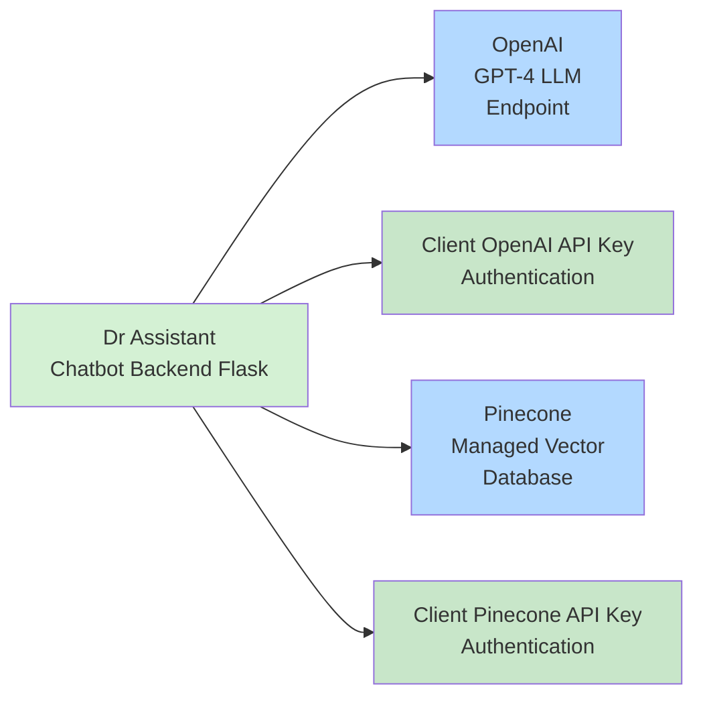

# Medical-Chatbot-Project

**Author:** Nigar Sultana  
**Email:** sultana.amin940@gmail.com  
**Project Presentation:** [View Slides](https://docs.google.com/presentation/d/1bBuPMjJeXtXyHyIMK6eBO9LrF12DbjpVrcaH__pvq2M/edit?slide=id.p#slide=id.p)

## Architecture Overview



The Dr Assistant Chatbot uses a Flask backend that integrates with:
- **OpenAI Cloud Platform**: GPT-4 LLM endpoint for conversational AI
- **Pinecone Cloud Platform**: Managed vector database for efficient document retrieval
- Both services authenticate via their respective API keys

## How to run?

### STEPS:

**Clone the repository**

```bash
git clone https://github.com/nsultana5/Medical--Chatbot-Project.git
cd Medical--Chatbot-Project
```

### STEP 01 - Create a conda environment after opening the repository

```bash
conda create -n medibot python=3.10 -y
```

```bash
conda activate medibot
```

### STEP 02 - Install the requirements

```bash
pip install -r requirements.txt
```

### STEP 03 - Configure API Keys

#### 1. OpenAI API Key Logistics (Managed LLM Endpoint)

The OpenAI API key is a **secret key** used to authenticate your requests for their Large Language Models (LLMs) and embeddings services.

| Step | Action | Description |
|------|--------|-------------|
| **1. Account** | **Sign Up/Log In** | Create or log in to your account on the **OpenAI Platform** website |
| **2. Navigate** | **Access API Keys Page** | Go to your profile menu (usually top-right) and select **"View API keys"** or navigate directly to the API Keys section on the dashboard |
| **3. Generate** | **Create New Secret Key** | Click the **"Create new secret key"** button. Give it an optional name for identification |
| **4. Copy & Store** | **Copy Key Immediately** | The key will be displayed **only once** (starts with `sk-`). **Copy it immediately** and save it in a secure location (e.g., a password manager or `.env` file) |

#### 2. Pinecone Setup Steps

**Account and API Key Acquisition**

1. **Sign Up/Log In**: Create an account or log in to the official **Pinecone console**.

2. **Get API Key**: Navigate to the **"API Keys"** section on the dashboard. Click to **create a new API key**, give it a name, and **copy the key value and environment** (e.g., `us-west1-gcp`) immediately. You'll need these to connect from your application.

**Create a `.env` file** in the root directory and add your Pinecone & OpenAI credentials as follows:

```env
PINECONE_API_KEY = "xxxxxxxxxxxxxxxxxxxxxxxxxxxxx"
OPENAI_API_KEY = "xxxxxxxxxxxxxxxxxxxxxxxxxxxxx"
```

### STEP 04 - Store embeddings to Pinecone

```bash
# Run the following command to store embeddings to pinecone
python store_index.py
```

### STEP 05 - Run the application

```bash
# Finally run the following command
python app.py
```

Now,

```bash
open up localhost:8080
```

---

## Techstack Used:
* Python
* LangChain
* Flask
* GPT-4
* Pinecone

---

## AWS CI/CD Deployment with Github Actions

### Deployment Architecture

```mermaid
graph LR
    A[Code Repository<br/>main branch<br/>Secrets] -->|1. git push| B[GitHub Actions]
    
    B -->|2. Checkout Code| C[Build Process]
    C -->|3. Configure AWS| D[Login to ECR]
    D -->|5. Build & Push| E[Docker Image]
    E -->|8. Pull Image| F[ECR - Elastic<br/>Container Registry]
    
    F --> G[AWS Cloud]
    G --> H[ECS Cluster]
    H --> I[Fargate<br/>Launch Type]
    I --> J[Serverless<br/>Compute]
    J -->|10. Access| K[User]
    
    B -->|6. Render Task| L[Task Definition]
    L -->|7. Deploy| H
    
    style A fill:#f0f0f0
    style B fill:#f5f5f5
    style C fill:#e3f2fd
    style D fill:#e3f2fd
    style E fill:#e3f2fd
    style F fill:#b3d9ff
    style G fill:#e1f5fe
    style H fill:#b3d9ff
    style I fill:#b3e5b3
    style J fill:#b3e5b3
    style K fill:#fff9c4
    style L fill:#e3f2fd
```



The deployment pipeline uses GitHub Actions to automatically build and deploy the application to AWS ECS Fargate:

1. **Code Repository**: Main branch with secrets (AWS credentials)
2. **GitHub Actions Workflow**:
   - Checkout code
   - Configure AWS credentials
   - Login to Amazon ECR
   - Build & push Docker image
   - Render ECS task definition
   - Deploy to ECS Fargate
3. **AWS Cloud**: ECS cluster with Fargate launch type running containerized application

### Deployment Steps

#### 1. Login to AWS console

#### 2. Create IAM user for deployment

**With specific access:**

1. **EC2 access**: It is virtual machine
2. **ECR**: Elastic Container Registry to save your docker image in AWS

**Description: About the deployment**

1. Build docker image of the source code
2. Push your docker image to ECR
3. Launch your EC2 
4. Pull your image from ECR in EC2
5. Launch your docker image in EC2

**Required Policies:**

1. `AmazonEC2ContainerRegistryFullAccess`
2. `AmazonEC2FullAccess`

#### 3. Create ECR repo to store/save docker image

```bash
# Save the URI
315865595366.dkr.ecr.us-east-1.amazonaws.com/medibot
```

#### 4. Create EC2 machine (Ubuntu)

#### 5. Open EC2 and Install docker in EC2 Machine:

```bash
# Optional
sudo apt-get update -y
sudo apt-get upgrade

# Required
curl -fsSL https://get.docker.com -o get-docker.sh
sudo sh get-docker.sh
sudo usermod -aG docker ubuntu
newgrp docker
```

#### 6. Configure EC2 as self-hosted runner:

```
Settings > Actions > Runner > New self-hosted runner > Choose OS > Then run commands one by one
```

#### 7. Setup GitHub secrets:

* `AWS_ACCESS_KEY_ID`
* `AWS_SECRET_ACCESS_KEY`
* `AWS_DEFAULT_REGION`
* `ECR_REPO`
* `PINECONE_API_KEY`
* `OPENAI_API_KEY`

---

## Project Structure

```
Medical--Chatbot-Project/
├── .github/
│   └── workflows/         # GitHub Actions CI/CD workflows
├── data/                  # Dataset and notebook experiments
├── research/              # Research and experimentation files
├── src/                   # Source code modules
├── static/                # Static files (CSS, JS, images)
├── templates/             # HTML templates for Flask
├── .gitignore            # Git ignore file
├── Dockerfile            # Docker configuration
├── LICENSE               # MIT License
├── README.md             # Project documentation
├── app.py                # Main Flask application
├── requirements.txt      # Python dependencies
├── setup.py              # Package setup file
├── store_index.py        # Script to store embeddings to Pinecone
└── template.py           # Template utilities
```

---

## License

MIT License

---

## Languages Used
* Jupyter Notebook: 99.7%
* Other: 0.3%